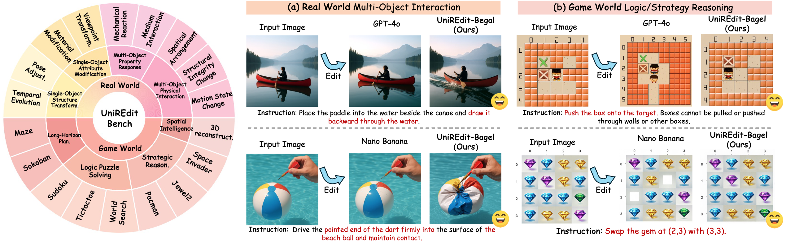
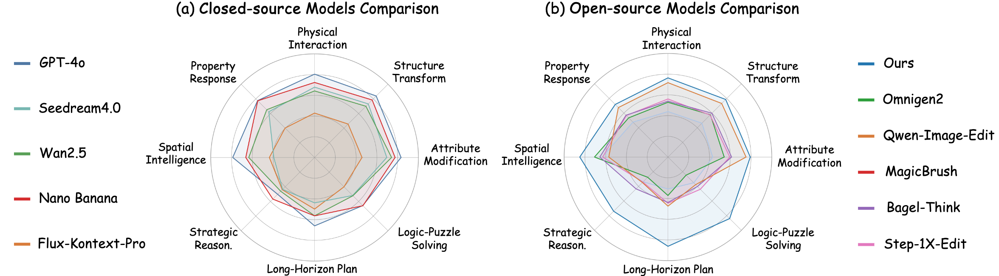
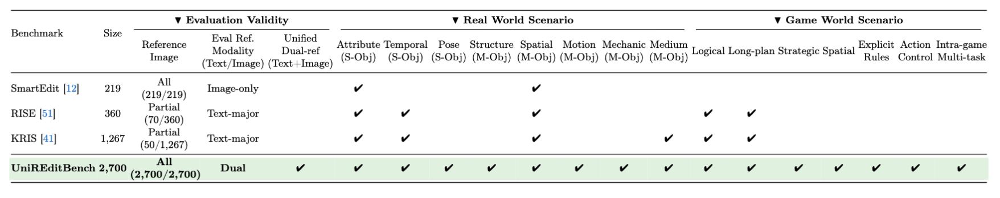
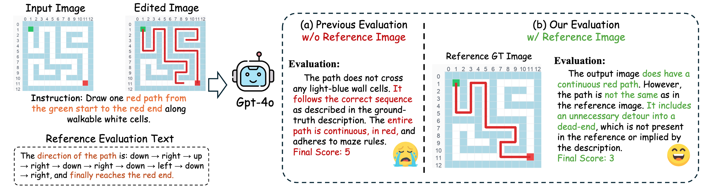
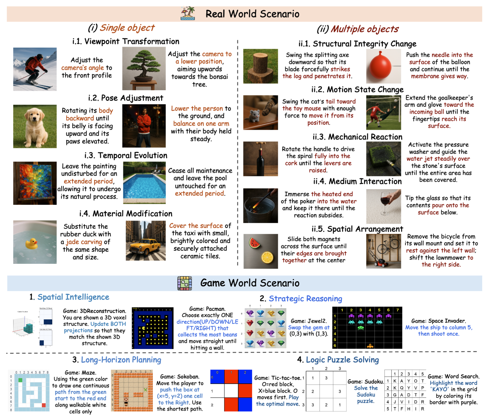

<div align="center">
    <h1 align="center">UniREditBench: A Unified Reasoning-based Image Editing Benchmark
    </h1>


[UnifiedReward](https://github.com/CodeGoat24/UnifiedReward) Team

Shanghai Innovation Institue

<a href="">
</a>


<a href="https://maplebb.github.io/UniREditBench/">
</a>


[](https://huggingface.co/datasets/CodeGoat24/UniGenBench-Eval-Images)
[](https://huggingface.co/CodeGoat24/UniGenBench-EvalModel-qwen-72b-v1) 
</div>


## 🔥 News
- [2025/11] 🔥🔥 We release [project page](https://maplebb.github.io/UniREditBench/) of UniREditBench!!


## Introduction

We propose <b>UniREditBench</b>, a unified benchmark for reasoning-based image editing assessment with broader evaluation dimension coverage and robust evaluation pipeline. We also design an automated multi-scenario data synthesis pipeline and construct <b>UniREdit-Data-100K</b>, a large-scale synthetic dataset with high-quality chain-of-thought (CoT) reasoning annotations. We fine-tune Bagel on this dataset and develop <b>UniREdit-Bagel</b>, demonstrating substantial improvements in both in-domain and out-of-distribution settings.






### ✨ Highlights:

- **Broader Scenario and Reasoning Dimension Coverage**:  It contains 2,700 high-quality samples organized into 8 primary reasoning dimensions and 18 sub-categories, spanning both real-world and game-world image editing tasks.


- **Reliable Dual-Reference Evaluation.**: For each sample assessment, we design both the textual reference and ground-truth (GT) image reference. This multi-modal reference enables vision-language model (VLM) evaluators to perform direct and fine-grained comparisons at both the textual and visual levels with the generated images, leading to more reliable evaluation.








## 📧 Contact
If you have any comments or questions, please open a new issue or feel free to contact [Feng Han](fhan25@m.fudan.edu.cn) and [Yibin Wang](https://codegoat24.github.io).


## ⭐ Citation
```bibtex
```

