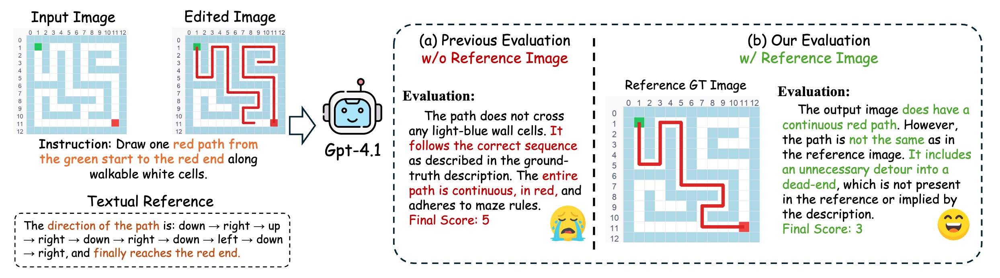

<div align="center">
    <h1 align="center">UniREditBench: A Unified Reasoning-based Image Editing Benchmark
    </h1>


[UnifiedReward](https://github.com/CodeGoat24/UnifiedReward) Team

Shanghai Innovation Institute

<a href="https://arxiv.org/abs/2511.01295">
</a>


<a href="https://maplebb.github.io/UniREditBench/">
</a>


[](https://huggingface.co/datasets/maplebb/UniREditBench)
[](https://huggingface.co/datasets/maplebb/UniREdit-Data-100K)
[](https://huggingface.co/maplebb/UniREdit-Bagel) 
<br>
[](https://huggingface.co/spaces/maplebb/UniREditBench_Leaderboard) 
</div>


## 🔥 News
- [2025/12] 🔥🔥 Lumina-DiMOO, UniWorld-V2, and DreamOmni2 are added to all 🏅Leaderboard.
- [2025/11/03] 🔥🔥 We release [UniREditBench](https://huggingface.co/datasets/maplebb/UniREditBench), [UniREdit-Data-100K](https://huggingface.co/datasets/maplebb/UniREdit-Data-100K), UniREdit-Bagel-[[BF16](https://huggingface.co/maplebb/UniREdit-Bagel-bf16)/[FP32](https://huggingface.co/maplebb/UniREdit-Bagel)], and 🏆 [Leaderboard](https://huggingface.co/spaces/maplebb/UniREditBench_Leaderboard) !!
- [2025/11/02] 🔥🔥 We release [paper](https://arxiv.org/abs/2511.01295) and [project page](https://maplebb.github.io/UniREditBench/) of UniREditBench!!


## Introduction

We propose <b>UniREditBench</b>, a unified benchmark for reasoning-based image editing assessment with broader evaluation dimension coverage and robust evaluation pipeline. We also design an automated multi-scenario data synthesis pipeline and construct <b>UniREdit-Data-100K</b>, a large-scale synthetic dataset with high-quality chain-of-thought (CoT) reasoning annotations. We fine-tune Bagel on this dataset and develop <b>UniREdit-Bagel</b>, demonstrating substantial improvements in both in-domain and out-of-distribution settings.


### ✨ Highlights:

- **Broader Scenario and Reasoning Dimension Coverage**:  It contains 2,700 high-quality samples organized into 8 primary reasoning dimensions and 18 sub-categories, spanning both real-world and game-world image editing tasks.


- **Reliable Dual-Reference Evaluation.**: For each sample assessment, we design both the textual reference and ground-truth (GT) image reference. This multi-modal reference enables vision-language model (VLM) evaluators to perform direct and fine-grained comparisons at both the textual and visual levels with the generated images, leading to more reliable evaluation.





## 🔥 Set Up Environment
```
conda create -n uniredit python=3.10 -y
conda activate uniredit
pip install -r requirements.txt
pip install flash_attn==2.7.0.post1 --no-build-isolation
```
You can also install `flash_attn` via:
```
# for cuda11 torch2.5.x
pip install "https://github.com/Dao-AILab/flash-attention/releases/download/v2.7.0.post1/flash_attn-2.7.0.post1+cu11torch2.5cxx11abiFALSE-cp310-cp310-linux_x86_64.whl"

# for cuda12 torch2.5.x
pip install "https://github.com/Dao-AILab/flash-attention/releases/download/v2.7.0.post1/flash_attn-2.7.0.post1+cu12torch2.5cxx11abiFALSE-cp310-cp310-linux_x86_64.whl"
```

## 🔧 Benchmark and Checkpoint Preparation
1. Benchmark Preparation
```
huggingface-cli download --resume-download maplebb/UniREditBench  --local-dir ./UniREditBench
cd UniREditBench
unzip original_image.zip
unzip reference_image.zip
```
2. UniREdit-Bagel Checkpoint Preparation
```
huggingface-cli download --resume-download maplebb/UniREdit-Bagel  --local-dir ./ckpt

pip install safetensors

python merge_ckpt.py
```

## 📑 Prompt Introduction
Each prompt in our benchmark is recorded as a dict in a `.json` file, combining with structured annotations for evaluation.  

- **original_image_path**: Path of the original image.
- **reference_image_path**: Path of the reference image.
- **instruction**: The editing instruction.
- **rules(only for game-world scenario)**: The concise descriptions of the specific game rules.
- **name**: The name of evaluation dimension.
- **idx**: Index of the evaluation example.
- **reference_effect**: The textual reference of edited effect.


## 🚀 Inference
```
GPUS=8
model_path=./ckpt
input_path=./UniREditBench
output_path=./output_images

# Image Editing with Reasoning
torchrun \
    --nnodes=1 \
    --nproc_per_node=$GPUS \
    gen_images_mp_uniredit.py \
    --input_dir $input_path \
    --output_dir $output_path \
    --metadata_file ./UniREditBench/data.json \
    --max_latent_size 64 \
    --model-path $model_path \
    --think
```

## ✨ Evaluation
We are using the API version: **[gpt-4.1-2025-04-14](https://platform.openai.com/docs/models/gpt-4.1)**


```
python -u eval/gpt_eval_uniredit.py \
  --input ./UniREditBench \
  --data ./UniREditBench/data.json \
  --output ./output_images \
  --nproc 6
```
- A detailed `.csv` **results file** will also be saved in the `/dir_of_edit_images` directory.

## 💻 Training

#### 1. UniREdit-Data-100K Download
```
huggingface-cli download --repo-type dataset --resume-download maplebb/UniREdit-Data-100K  --local-dir ./UniREdit-Data-100K

cd UniREdit-Data-100K

# For linux (Debian、Ubuntu)
apt-get install p7zip-full 
7z x UniREdit-Data-100K.zip
```

#### 2. Prepare Training Parquet
```
mkdir training_data

python -u gen_train_json_and_parquet.py --src_json ./UniREdit-Data-100K/train_data.json --dataset_dir ./UniREdit-Data-100 --out_json ./training_data/all_data.json --out_parquet_dir ./training_data
```

#### 3. Train
1. Edit every placeholder in `data/dataset_info.py`.
2. Clone the github repository of Bagel.
3. Replace Bagel's `data/` with our `data/`.
4. Reference `train.sh` and the training guide of Bagel for fine-tuning.

## 📧 Contact
If you have any comments or questions, please open a new issue or feel free to contact [Feng Han](fhan25@m.fudan.edu.cn) and [Yibin Wang](https://codegoat24.github.io).


## ⭐ Citation
```bibtex
@article{unireditbench,
  title={UniREditBench: A Unified Reasoning-based Image Editing Benchmark},
  author={Han, Feng and Wang, Yibin and Li, Chenglin and Liang, Zheming and Wang, Dianyi and Jiao, Yang and Wei, Zhipeng and Gong, Chao and Jin, Cheng and Chen, Jingjing and others},
  journal={arXiv preprint arXiv:2511.01295},
  year={2025}
}
```


